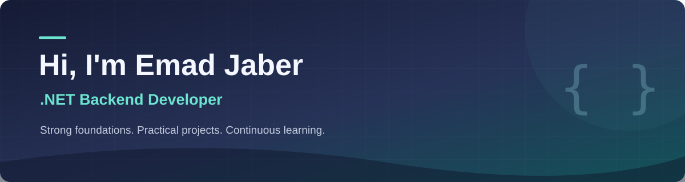

  

  <b>C# · ASP.NET Core · SQL Server</b> 
  Building on a foundation in C++, problem solving, and object-oriented programming.

  

  <a href="https://www.linkedin.com/in/emad-jaber">LinkedIn</a> ·
  <a href="mailto:emadjbr2003@gmail.com">emadjbr2003@gmail.com</a>

## About me

I'm Emad, a developer focused on **backend development with .NET**. I work with C#, ASP.NET Core APIs, SQL Server, and ADO.NET, and have hands-on experience building Windows Forms applications.

I started with C++ and spent time practicing algorithms, problem solving, OOP, and data structures before moving into C# and databases. I enjoy understanding how a system works, then turning that understanding into working software.

> Understand the fundamentals. Build something useful. Keep improving.

## My learning path

I studied with **[Programming Advices](https://www.programmingadvices.com/)**, led by **Mohammed Abu-Hadhoud**, and have completed **courses 01–20** of the programming foundations roadmap, through **C# Level 2**.

That journey covered:

- Programming foundations, C++, algorithms, and problem solving.
- Object-oriented programming and foundational data structures.
- C#, SQL, database design practice, and ADO.NET.
- Building a complete desktop project and connecting its layers to a database.

## Technologies I use

| Focus | Technologies |
|---|---|
| Backend | C#, .NET, ASP.NET Core, REST APIs |
| Databases | SQL Server, SQL, ADO.NET |
| Desktop | Windows Forms |
| Programming foundations | C++, OOP, algorithms, data structures |
| Tools | Git, GitHub, Visual Studio |

## Featured work

### [DVLD — Graduation Project](https://github.com/emadAlaa2003/DVLD_GraduationProject)

A team graduation project built around driver and vehicle licensing workflows. It extends the DVLD desktop project from my learning path with an ASP.NET Core API, citizen services, and document-based AI features.

My work includes backend and desktop development, database integration, and features for document processing, question generation, and a knowledge assistant using **Ollama** and **Qdrant**.

The project brings together **C# / WinForms**, **ASP.NET Core**, **SQL Server**, and an **Android citizen application**. It is an ongoing academic project.

### University Android projects

I also use **Java and Android** for university coursework, including [AceIT](https://github.com/emadAlaa2003/AceItApp), a study organizer, and the citizen application in DVLD. These repositories represent learning and project work at different stages of completion; my main focus remains .NET backend development.

---

  Learning with purpose, building with care. 
  <a href="https://github.com/emadAlaa2003?tab=repositories">Explore my repositories</a>

